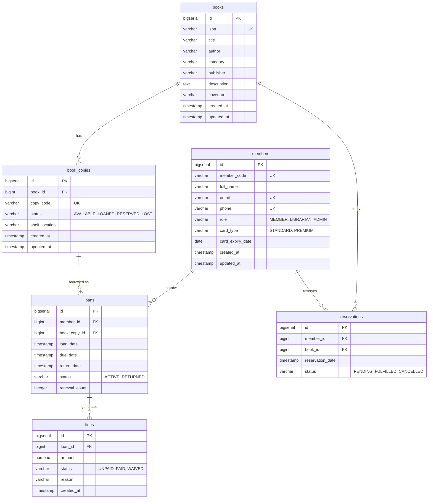

# Hệ thống Quản lý Thư viện Sách (Fullstack)

Dự án này là hệ thống thư viện số hỗ trợ quản lý kho sách, đăng ký mượn sách, theo dõi thời hạn trả và tính phí phạt trễ hạn.

## ERD (Sơ đồ Cơ sở Dữ liệu)

## Yêu cầu Hệ thống
- JDK 21+
- Node.js 18+
- PostgreSQL 15+
- Maven (cho backend)

## Hướng dẫn cài đặt Backend
1. Mở thư mục `backend`
2. Cấu hình file `src/main/resources/application.yml` (hoặc tạo file `.env` tham chiếu tới DB PostgreSQL)
3. Chạy `.\mvnw.cmd spring-boot:run`
4. Flyway sẽ tự động chạy các file SQL Migration và khởi tạo schema cũng như dữ liệu mẫu (admin: member/member123, librarian: lib/lib123, member: member/member123).
5. API chạy ở cổng `8080` (Swagger UI: `http://localhost:8080/swagger-ui.html`)

## Hướng dẫn cài đặt Frontend
1. Mở thư mục `frontend`
2. Chạy `npm install`
3. Chạy `npm run dev`
4. Truy cập `http://localhost:5173`
5. Bạn có thể đăng nhập bằng mã thẻ:
   - Admin: `admin` (Mật khẩu bất kỳ do BE không kiểm tra)
   - Librarian: `librarian`
   - Member: `member`

## Các tính năng chính
1. **Quản lý Thành viên**: Thêm/Sửa/Xoá, phân quyền RBAC.
2. **Quản lý Sách và Kho**: Quản lý đầu mục sách, quản lý các bản sao (Book copies).
3. **Mượn/Trả sách**: Nghiệp vụ quản lý phiếu mượn, kiểm tra tự động phát sinh Fine (phí phạt) khi quá hạn.
4. **Đặt chỗ**: Đặt chỗ (Reservation) sách đã hết và tự động thông báo/chuyển trạng thái khi có người trả sách.
5. **Thống kê**: Bảng điều khiển (Dashboard) cho thủ thư và quản trị viên, xuất file CSV.
